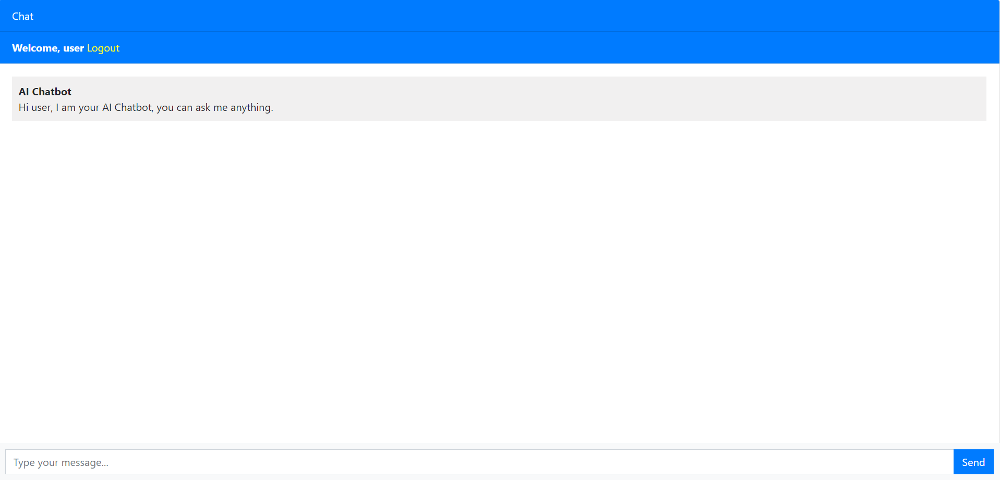
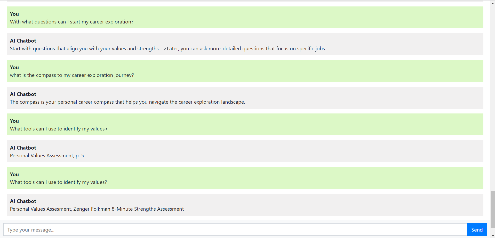
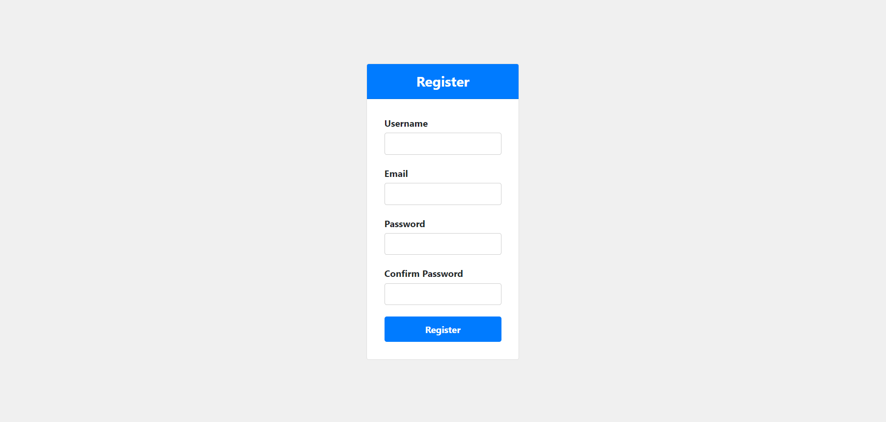
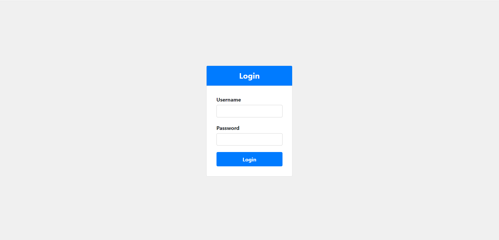

# 📝 HUUGO CHATBOT: AI-driven Career Coaching Assistant 

> A fine-tuned AI chatbot application in Django using OpenAI API, SQLite and Bootstrap.

## Table of Contents
* [Setup](#setup)
* [Usage](#usage)
* [Technologies Used](#technologies-used)
* [Project Status](#project-status)
* [Contact](#contact)
<!-- * [License](#license) -->

## Setup
Run the following commands in the terminal:-
- git clone https://github.com/Priii29/HUUGO-CHATBOT.git
- cd HUUGO-CHATBOT
- `pip install -r requirements.txt`

## Usage
Run the following command in the terminal from the Project Directory:-
- python manage.py

# Main Page

# Registration Page

# Login Page

## Technologies Used
- HTML/CSS (Bootstrap 4.3.1)
- Python 3.10.5 (Django)
- SQL (SQLite)

## Project Status
The minimum viable product is *complete*

## Contact
Priyanshi Ramani: pramani@uwaterloo.ca
